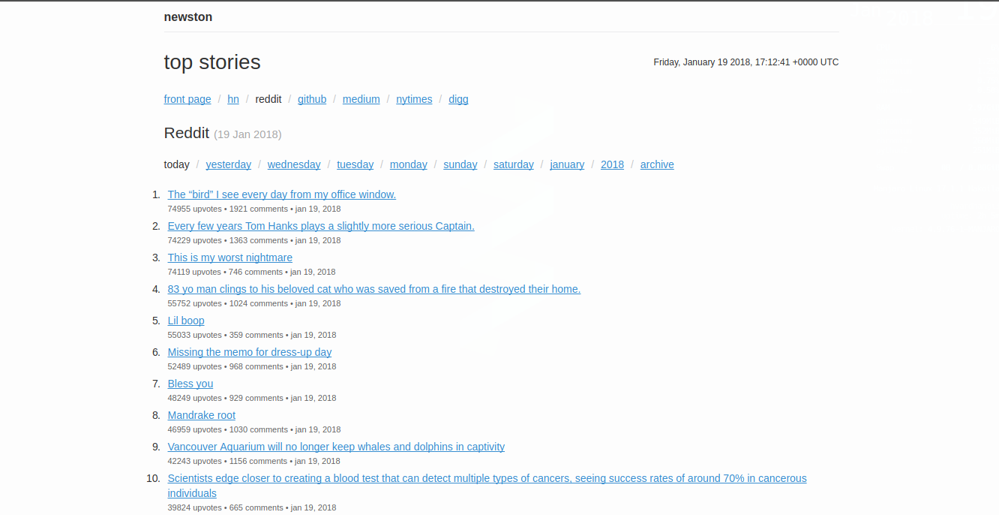
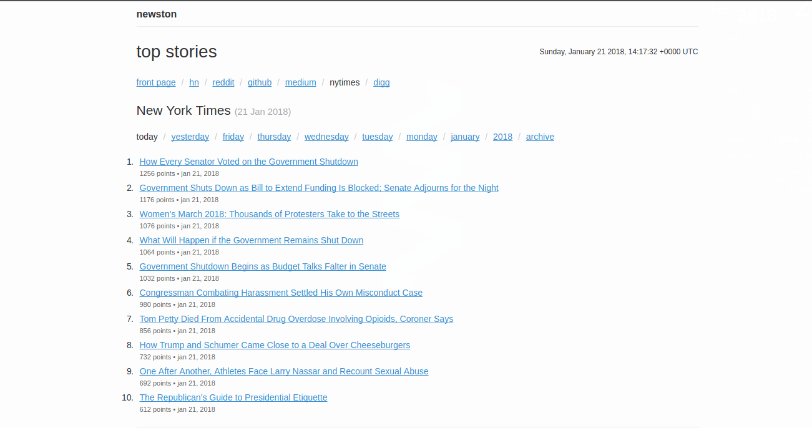

# Newston

Simple news aggregator from HN, Reddit, NYTimes, Digg and Medium

### Instructions on how to run:

#### Setup the development environment:

##### Pre-requisites:

* Setup your .env file with SECRET_KEY, DATABASE_URL, NYTIMES_API_KEY.
* Install the required libraries.

```python
 pip install -r requirements.txt
```

##### Running the app:

```python
python manage.py runserver
```

* For crawling data from various sources. Run:

```python
python scripts/top.py
```

* `scripts/top.py` collects data from various sources (HN/Reddit/NYTimes/Github)
	at regular intervals and saves it to the database.

##### Screenshots (Because everyone loves it!) :




